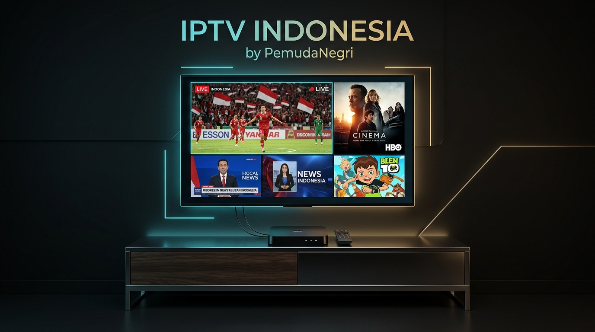

<div align="center">

# 📺 IPTV INDONESIA & STB PRO
### *Solusi Smart TV Premium, Siaran Lengkap, & Bioskop VOD Tanpa Batas*



<p align="center">
  
  
  
  
  
</p>

---

**Selamat datang di repositori resmi IPTV Indonesia oleh PemudaNegri!**  
Repositori ini dirancang khusus untuk layanan **Smart TV Box (STB Android)** dengan sistem **Multi-Playlist**, performa ringan anti-lemot, serta didukung sistem langganan otomatis.

</div>

---

## 🌟 Fitur Unggulan

* 🚀 **Multi-Playlist Anti-Lag:** Pemisahan otomatis antara siaran TV Langsung (*Live TV*) dan Perpustakaan Film (*VOD*) sehingga STB RAM 1GB sekalipun tetap sangat ringan dan responsif.
* 🛡️ **Bebas Siaran Mati / Error:** Seluruh saluran telah melalui pengujian *multi-thread live* secara rutin.
* 🎬 **Perpustakaan Media 400+ Judul:** Dilengkapi metadata poster cover dan kompatibilitas penuh dengan menu VOD OTT Navigator & TiviMate.
* ⚡ **Dukungan Cloudflare Edge:** Kecepatan respon server super kilat (10–20ms) langsung dari data center Jakarta.
* 🔒 **Sistem Kontrol Langganan Bulanan:** Pengaturan tanggal kedaluwarsa otomatis via Cloudflare Worker (`worker.js`).

---

## 📂 Link Playlist Resmi (Pilih Sesuai Kebutuhan)

| Tipe Playlist | Deskripsi | Link M3U Langsung |
| :--- | :--- | :--- |
| 📡 **`live.m3u`** | **Khusus Siaran TV Langsung (200+ Saluran)**<br>*(TV Nasional, Sports/Bola, HBO, Kartun, TV Daerah)* | `https://raw.githubusercontent.com/PemudaNegri/iptv-indonesia/main/live.m3u` |
| 🍿 **`vod.m3u`** | **Khusus Perpustakaan Film Bioskop (400+ Judul)**<br>*(Warkop DKI Lengkap, Box Office, Horor, Animasi)* | `https://raw.githubusercontent.com/PemudaNegri/iptv-indonesia/main/vod.m3u` |
| 📦 **`playlist.m3u`** | **Master Playlist Komplit (Auto-Split)**<br>*(Otomatis memisahkan menu Live TV & VOD di STB)* | `https://raw.githubusercontent.com/PemudaNegri/iptv-indonesia/main/playlist.m3u` |

---

## 📊 Rincian Kategori Siaran

```
┌─────────────────────────────────────────────────────────────┐
│                    KATEGORI SIARAN LENGKAP                  │
├──────────────────────────────┬──────────────────────────────┤
│ 📺 [ID] TV NASIONAL          │ ⚽ [SPORTS] OLAHRAGA & BOLA   │
│ • RCTI, SCTV, Indosiar       │ • SPOTV 1 & 2 (MotoGP, BWF)  │
│ • Trans TV, Trans7, tvOne    │ • beIN Sports (La Liga, UCL) │
│ • Kompas TV, Metro TV, RTV   │ • TNT Sports, Premier League │
├──────────────────────────────┼──────────────────────────────┤
│ 🎬 [MOVIES] BIOSKOP & FILM   │ 👶 [KIDS] ANAK & ANIMASI     │
│ • HBO, HBO Hits, HBO Family  │ • Animax, Cartoon Network    │
│ • Cinemax, Warner TV, AXN    │ • Nickelodeon, Nick Jr       │
│ • Celestial Movies, HITS     │ • CBeebies, Mentari TV       │
├──────────────────────────────┼──────────────────────────────┤
│ 🏢 [ID] TV DAERAH            │ 🍿 [VOD] PERPUSTAKAAN FILM   │
│ • JTV Surabaya, Bali TV      │ • 35+ Koleksi Warkop DKI     │
│ • Bandung TV, JakTV, DAAI TV │ • Box Office Hollywood       │
│ • JawaPos TV, Antara TV      │ • Horor Indonesia & Kartun   │
└──────────────────────────────┴──────────────────────────────┘
```

---

## 📱 Panduan Pemasangan di STB (3 Langkah Mudah)

### 1. Menggunakan OTT Navigator
1. Buka aplikasi **OTT Navigator** di STB Anda.
2. Masuk ke **Pengaturan (Settings / Ikon Gerigi)** $\rightarrow$ **Daftar Putar (Playlists)**.
3. Klik **Tambah Daftar Putar (Add Playlist)** $\rightarrow$ Tempelkan link:
   ```text
   https://raw.githubusercontent.com/PemudaNegri/iptv-indonesia/main/playlist.m3u
   ```
4. Di menu **Pengaturan $\rightarrow$ Pemutar (Player)**: Ubah *Mesin Media* menjadi **VLC Engine** (atau *Hardware / SurfaceView*).
5. Selesai! Menu TV dan Perpustakaan Media akan langsung terpisah otomatis.

### 2. Menggunakan TiviMate IPTV Player
1. Buka **TiviMate** $\rightarrow$ Pilih **Add Playlist** $\rightarrow$ **M3U Playlist**.
2. Masukkan URL playlist di atas $\rightarrow$ Klik **Next**.
3. TiviMate akan otomatis mengelompokkan siaran TV ke tab **TV** dan film ke tab **Movies**.

---

## ⚙️ Sistem Langganan Bulanan (Cloudflare Worker)

Repositori ini telah dilengkapi dengan skrip **`worker.js`** untuk menjalankan sistem bisnis langganan bulanan tanpa modal server:

1. Buat worker baru di [dash.cloudflare.com](https://dash.cloudflare.com) $\rightarrow$ Tempelkan isi file **`worker.js`**.
2. Format link untuk pelanggan Anda:
   * **Paket Lengkap:** `https://worker-anda.workers.dev/?user=nama_pelanggan`
   * **Paket Khusus TV:** `https://worker-anda.workers.dev/?user=nama_pelanggan&type=live`
3. Perpanjang tanggal aktif pelanggan kapan saja langsung dari HP dalam 5 detik!

---

<div align="center">

### 💼 Usaha Servis STB & IPTV Pro
*Dioptimalkan untuk ZTE B860H, B866F, Fiberhome HG680P, Akari AX512, dan Semua Android TV Box.*

**Dikelola secara aktif oleh [@PemudaNegri](https://github.com/PemudaNegri)**

</div>
